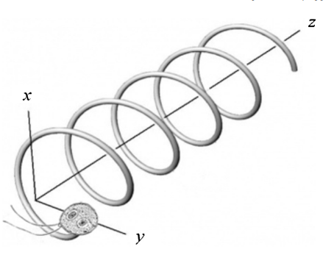
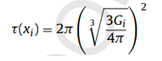
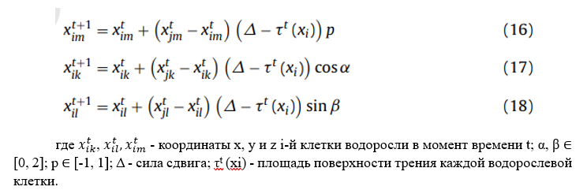
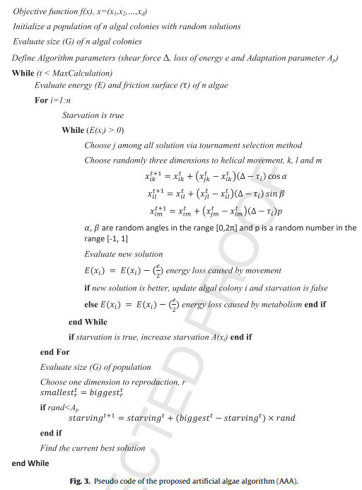
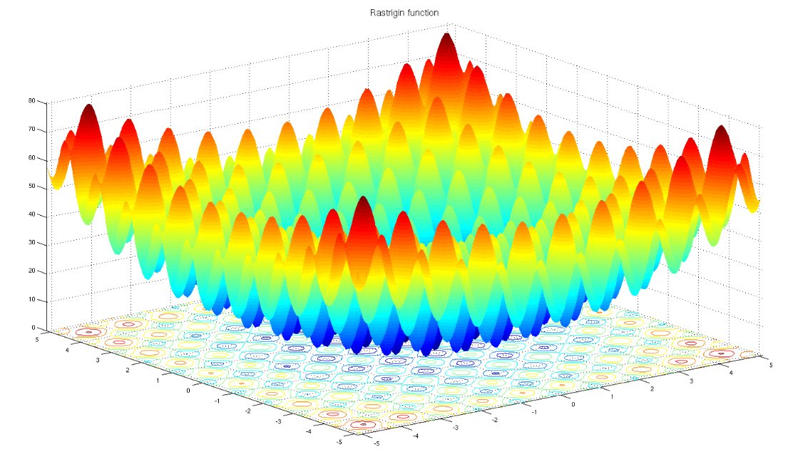
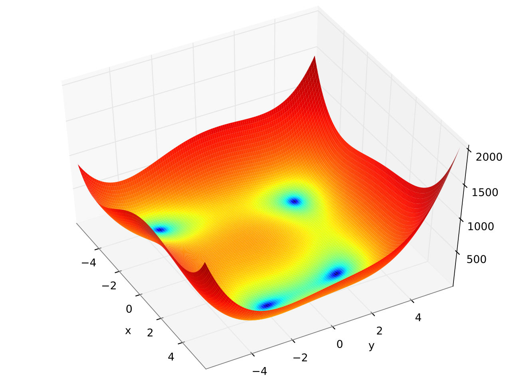
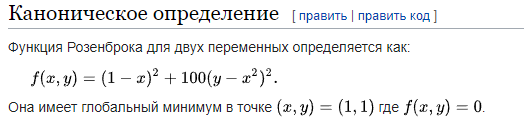
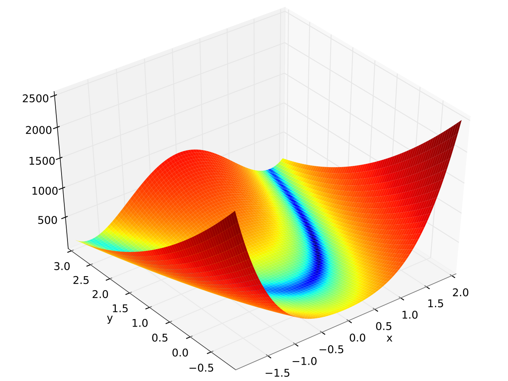
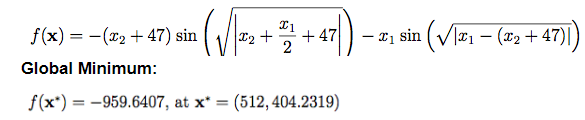
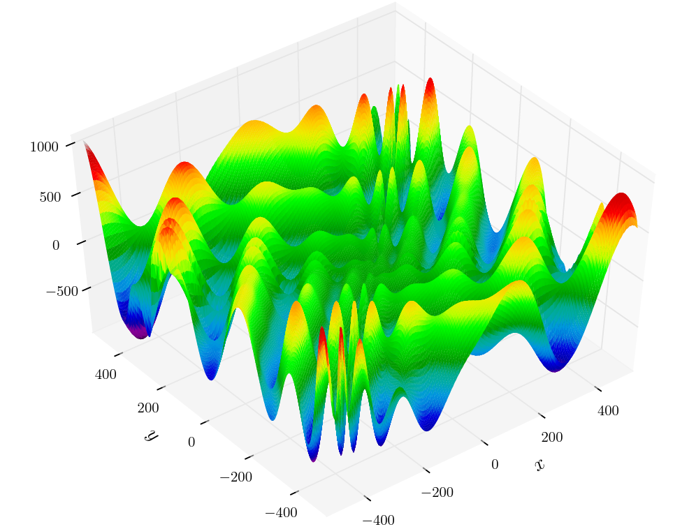

# Artificial Algae Algorithm
## Задача: подобрать и использовать эвристический алгоритм (по типу роевого алгоритма) для поиска глобального минимума функций

Алгоритм искусственных водорослей был вдохновлен поведением фотосинтезирующих одноклеточных водорослей, которые движутся к солнцу.
Глобальный минимум - точка, в которой волдоросли могут получить больше всего солнечной энергии. В процессе движения водоросли сталкиваются с споротивлением жидкости. 
Клетки водорослей имеют разные размеры.

Алгоритм состоит из 3-х основных частей: адаптация, эволюция, спиральное движение.

#### Эволюция 
При достаточных питательных условиях, если колония водорослей получает достаточно света, она растет и размножается (т.е. создаются новые клетки водорослей). 
Напротив, колония водорослей, не получающая достаточно света, выживает некоторое время, но в конце концов погибает.
Эволюционный процесс оценивается по приспособленности водорослевой клетки.
(см. функцию "tournament_selection")

#### Адаптация  
Колония водорослей, которая не может расти в достаточной степени в той или иной среде, пытается приспособиться к окружающей среде, и в результате доминирующий 
вид меняется. Этот процесс завершается изменением уровня голода в алгоритме.

Начальное значение уровня голода равно нулю для каждой искусственной водоросли. Величина голодания увеличивается с течением времени t, когда клетка 
водоросли получает недостаточное количество света. Искусственная водоросль, имеющая наибольшее значение голодания, адаптируется.

#### Спиральное движение
Клетки водорослей плавают по спирали в жидкости с помощью своих жгутиков, это продемонстрировано на изображении ниже
 
 

 

Движения клеток водорослей различны. По мере увеличения поверхности трения растущей водорослевой клетки, частота спиралевидных движений увеличивается за счет увеличения их способности к локальному поиску. Каждая водорослевая клетка может перемещаться пропорциональна ее энергии. Энергия водорослевой клетки в момент времени t прямо пропорциональна количеству поглощенных питательных веществ за это время. Поэтому чем ближе водорослевая клетка к поверхности, тем больше у нее энергии, и она находит больше возможностей двигаться внутри жидкости. Напротив, если поверхность трения меньше, расстояние их перемещения в жидкости больше. Поэтому их способность к глобальному поиску больше.

Поверхность трения водорослевой клетки об жидкость предсатвляет собой полусферу и задается формулой:

 

 

(Формула в данном алгоритме "calculate_friction")

Геликолиальное движение задается 3-мя уравнениями, одно из них обеспечивает линейное движение (16), а два других угловое (17, 18):

 

 

#### Псевдокод данного алгоритма

 

 

### Используемые функции
В данной работе алгоритм тестируется на следующих функциях:
- Растригина
- Химмельблау
- Розенброка
- "Подставка для яиц" (Egg holder)

#### Теоретические значения глобальных минимумов функций:

#### Функция Растригина
 

 

 

 

#### Функция Химмельблау
 

 

 

 

#### Функция Розенброка
 

 

 

 

#### Функция Egg holder
 

 

 

 

### Тестирование алгоритма 
Для каждой функции подбирались свои гиперпараметры модели: 
- Размер популяции - PopulationSize;
- Количесвто итераций алгоритма;
- Сила сдвига (влияет на движение клетки водоросли) s_force;
- Потеря энергии e_loss;
- Параметр адаптации ap;
- lb и ub - область определения функции. 

При тестировании на разных функциях использовался автоподбор гиперпараметров для модели.

