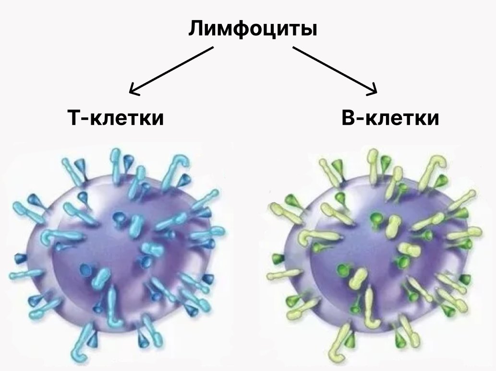
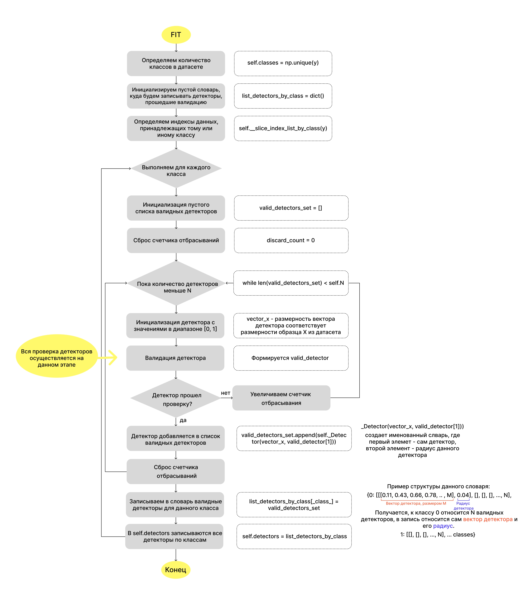
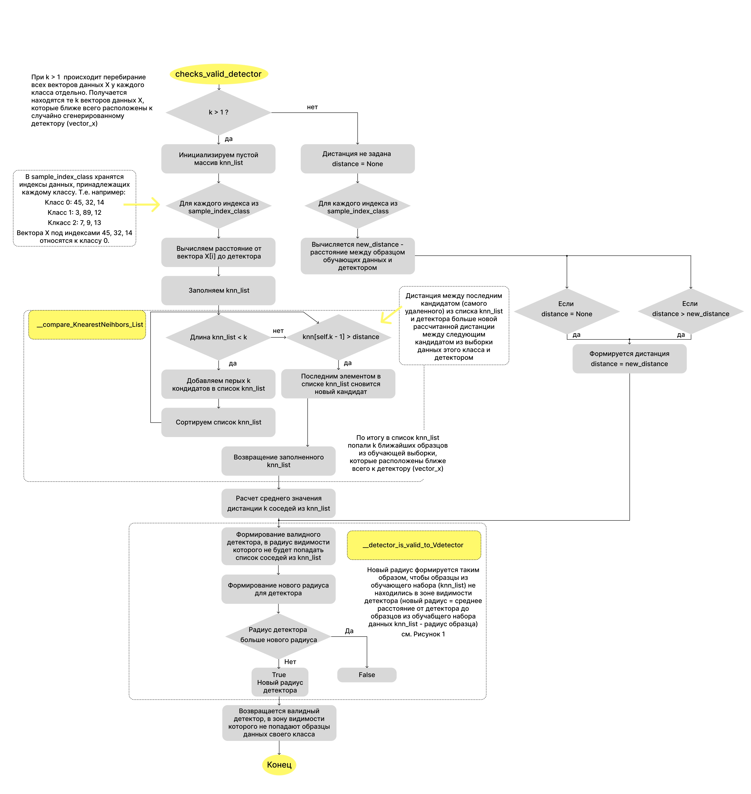
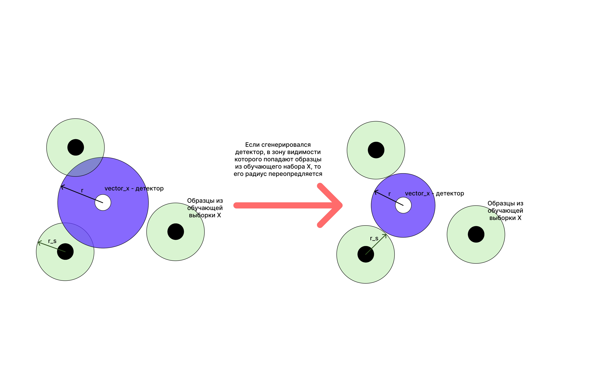
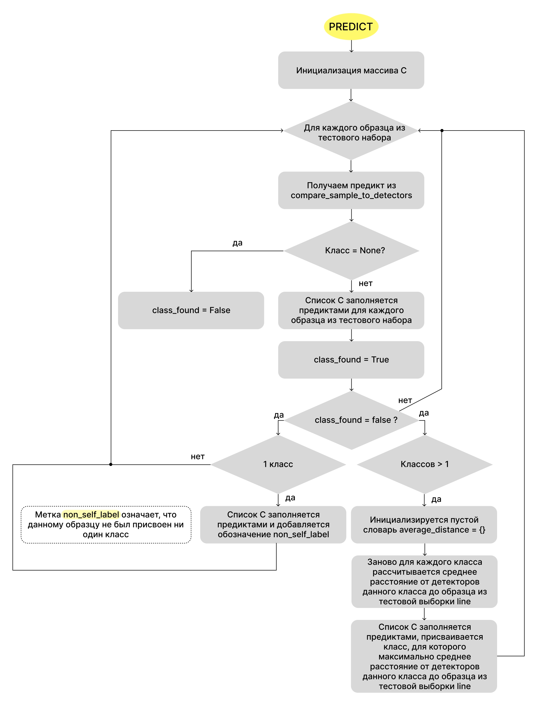
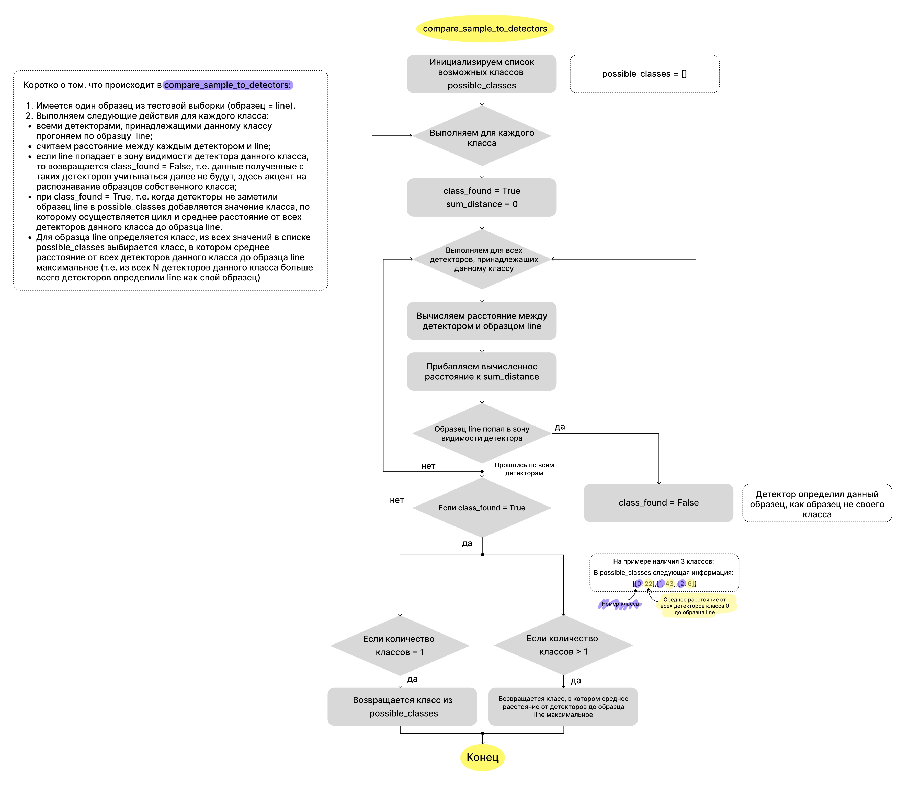
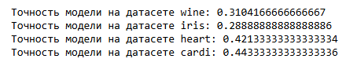
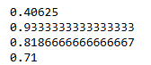
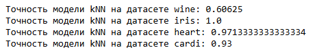
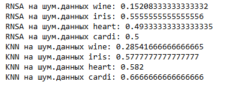

# Artificial Immune Sistem
## Задача: разработать алгоритм искусственной иммунной системы и применить его в отношении задачи классификации

Искусственная иммунная система (ИИС) моделирует способность естественной иммунной системы обнаруживать чужеродные для организма клетки. Главным функционирующим элементом в иммунной системе являются лимфоциты. Лимфоциты бывают двух видов: В-клетки и Т-клетки. И те и другие обладают специфическими рецепторами, которые соответсвуют одному типу антигена. Антиген - это и есть патологическая клетка (если быть точнее, это белок на поверхности патологической клетки).
 

#### Существует три модели ИИС:
- клональный отбор;
- отрицательный отбор;
- сетевая ИИС.
  
1 и 3 основаны на принципе действия В-клеток лимфоцитов. 2-ая модель рассматривает принцип созревания Т-лимфоцитов в тимусе. 
Т-клетки помогают В-клеткам вырабатывать антитела для подавления патологических клеток.

На поверхности собственных клеток также как и на поверхности антигенов (патологических клеток) имеются рецепторы, чтобы лимфоциты 
не атаковали собственные клетки организма, они должны обладать "памятью". Формирование данной "памяти" происходит как раз при созревании 
Т-клеток лимфоцитов. Внутри вилочковой железы происходит отрицательная селекция клеток Т-лимфоцитов. Эту селекцию проходят только те особи, 
которые не способны атаковать собственные клетки организма, таким образом уничтожаются все клетки Т-лимфоцитов, которые могут реагировать с 
собственными клетками организма - в этом и заключается алгоритм отрицательного отбора.

В данной работе роль Т-лимфоцитов представляют детекторы, которые имеют размерность, в соотвествии с вектором из обучающего набора данных. 
Для каждого класса генерируется N-детекторов, которые проходят свой отрицательный отбор в функции fit. Затем в результате обучения возвращаются детекторы (Т-лимфоциты), 
которые не реагируют на собственный класс (на собственные клетки организма). Классификация тестового набора данных происходит в функции predict. Здесь, если вектор данных 
попадает в радиус видимости детектора, то детектор классифицирует данный вектор как "патологическую клетку" - образец не его класса.

### Как работает обучение в данной работе? 
Для каждого класса инициализируется N детекторов [0, 1]. Детекторы инициализируются таким образом, чтобы в их "радиус видимости" не попадали образца из обучающего набора собсвтенного класса. 
Т.е. детекторы класса 0 не должны видеть образцы из тренировочного набора данных, принадлежащие классу 0 (= Т-клетка не должна реагировать на собственные клетки организма). Аналогично для всех классов. Основная часть инициализации детекторов задается в функции checs_valid_detectors. Если детектор прошел проверку по радиусу, то он добавляется в список Т-клеток для созревания, если нет, то для детектора вычисляется новый радиус, благодаря которому детектор пройдет проверку.
Схемотично алгоритм обучения представлен ниже: 

Каким должен инициализироваться детектор: 

 

 ### Как работает predict в данной работе? 
 По каждому образцу из тестового набора проходимся всеми детекторами (детекторами всех классов), детекторы каждого класса делают предикт о принадлежности данного образца к своему классу. Считается среднее расстояние от всех детекторов каждого класса до образца из тестового набора. По итогу образцу присваится тот класс, где данное расстояние наибольшее (т.е. образец из тестового набора находится дальше всего от группы детекторов данного класса, следовательно, он принадлежит к данному классу, ведь детекторы изначально генерировались так, чтобы в их радиус видимости не попадали образцы собственного класса).
Схемотично алгоритм классификации тестоого набора представлен ниже: 

 

 

 ### Классифкация 
 Обучение и тестирование модели проводилось на четырех датасетах и результаты сравнивались с классическим kNN.
 Предварительно осуществлялась нормализация данных. Также для модели искусственной иммунной системы осуществлялся подбор гиперпараемтров с помощью optuna.
 
 #### Тестирование модели: 
 
 При тестировании на нормализованных данных без подбора гиперпараметров результат получился следующим: 
 
 

 

После подбора гиперпараметров для модели: 

 

 

Результаты kNN: 

 

 

#### Выводы: 
kNN лучше справляется с классификацией данных

#### Для попытки повышения качества классификации модели ИИС данные в датасетах были искусственно зашумлены. 
Результаты тестирования:

 

 

