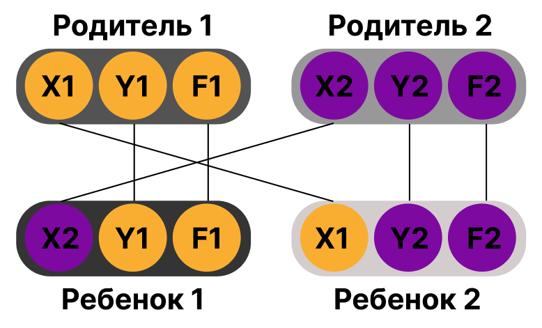

# Genetic Algorithm
## Задача: использовапть генетический алгоритм для поиска глобального минимума функций и сравнить с эвристическим алгоритмом

В данной работе использовался гибридный генетический алгоритм (генетический алгоритм + эмитация отжига) HGASA

Генетический алгоритм - разновидность эволюционного алгоритма, основанный на процессе отбора, мутации и скрещивания. Основные шаги алгоритма:

1. Инициализация начальной популяции
2. Вычисление приспособленности каждой особи в проекции на целевую функцию
3. Селекция
4. Скрещивание
5. Мутация

Каждая хромосома (особь) обладает тремя параметрами (генами. см. картинку ниже):
- положение по оси Х;
- положение по оси Y;
- значение приспособленности (fitness function).

 

 

На *первом этапе* создается начальная популяция со случайными значениями всех трех генов (`generate_chromosome`). 

На *втором этапе* значение третьего гена уточняется, при проецировании координат хромосом на целевую функцию (`fitness`). 

На *третьем этапе* осуществляется селекция популяции хромосом. В нашей работе внутри функции `selection` происходит распределение всех особей на партнеров для дальнейшего размножения. В результате возвращается список последовательно записанных пар. 

На *четвертом этапе* происходит скрещивание между парами, выделенными на предыдущем этапе (`crossover`). От каждой пары рождается два потомка, которые наследуют первые два гена от родителей по законам Менделя (см. рисунок ниже). 

На *пятом этапе* с определенной вероятностью (<u>mutation_prob</u>) гены части популяции мутируют. В зависимости от параметра <u>var</u> мутация происходит либо с двумя генами сразу, либо с одним (`mutation`). Мутирует положение хромосомы по координатам Х и Y.

По завершению пятого этапа происходит отбор наиболее приспособленных особей. Особи с наименьшим показателем значения F (fitness function) 

популяция с мутированными генами становится основной и на следующую итерацию вместо инициализации новой популяции  

mutation(population, mutation_prob, var)

 

 

#### Про алгоритм отжига: 

Метод отжига - один из методов стохастической оптимизации. Он представляет собой упорядоченный случайный поиск 
оптимума целевой функции. Алгоритм метода отжига основан на имитации процесса образования кристаллической структуры в веществе. 
Атомы в кристаллической решетке вещества — например, металла — при понижении температуры могут либо  переходить в состояние с меньшим уровнем энергии, либо оставаться на месте. Вероятность перехода в новое состояние уменьшается пропорционально температуре. Имитируя такой процесс, находится минимум или максимум целевой функции.

Более простыми словами об идеи метода отжига: 

Идея основана на процессах на процессах происходящих в металле при отжиге. Металл нагревается до высокой температуры, и затем происходит медленное постепенное его охлаждение при котором кристаллические элементы металла на начальной стадии процесса (при высокой температуре) хаотически, свободно передвигаются. Далее при понижении температуры движение замедляется и элементы стремятся занять положение с наименьшей энергией взаимосвязей.  

Этот алгоритм используется в комбинации с генетическим для избежания преждевременного схождения к локальному минимуму.

#### Функции
Функции использовались те же, что и в алгоритме [искусственных водорослей](https://github.com/vmokook/Heuristic-algorithms/blob/main/AAA/AAA.md): Растригина, Химмельблау, Розенброка, Egg holder. 

## Тестирвоание алгоритма

Было выполнено сравнение результатов работы генетического алгоритма и гибритного, чтобы показать, что гибридный алгоритм повышает точность попадания в глобальный минимум функции. В качестве метрики ошибки использовалось СКО. Также приведены результаты сравнения с алгоритмом искусственных водорослей.

*Аналогично с работой по искусственным водорослям в алгоритме для каждой функции осуществлялся подбор гиперпараметров с помощью optuna.

### Таблицы сравнений результатов
#### Для функции Растригина 

| Кол-во итераций | СКО Генетического алгоритма | СКО Гибридного алгоритма | СКО ААА |
| --------------- | --------------------------- | ------------------------ | ------- |
| 25	| 0.033 |	0.019 |	0.297 |
| 50	| 0.028 |	0.032 | 0.106 |
| 75 |	0.036 |	0.027 |	- |

#### Для функции Химмельблау 

| Кол-во итераций | СКО Генетического алгоритма | СКО Гибридного алгоритма | СКО ААА |
| --------------- | --------------------------- | ------------------------ | ------- |
| 25	| 0.00119	| 0.00077 |	0.31020 |
| 50	| 0.00125 |	0.00067 |	0.29970 |
| 75 |	0.00117	| 0.00079	| - |

#### Для функции Розенброка 

| Кол-во итераций | СКО Генетического алгоритма | СКО Гибридного алгоритма | СКО ААА |
| --------------- | --------------------------- | ------------------------ | ------- |
| 25	| 0.0087 |	0.0057 |	0.0470 |
| 50	| 0.0050 |	0.0041 |	0.0720 |
| 75 |	0.0069 | 0.0031 |	- |

#### Для функции Egg holder 

| Кол-во итераций | СКО Генетического алгоритма | СКО Гибридного алгоритма | СКО ААА |
| --------------- | --------------------------- | ------------------------ | ------- |
| 25	| 2.25	| 1.73 |	94.89 |
| 50	| 2.21 |	1.87 |	136.02 |
| 75 |	2.65 | 1.41	| - |

Вывод: отклонение у алгоритма искусственных водорослей (ААА) намного больше, чем у генетического алгоритма. В свою очередь наблюдаем, что при использовании гибридного алгоритма отклонение уменьшается, что означает - точность попадания в глобальный минимум функции выше. Оосбенно хорошо качество работы генетического алгоритма и гибридного генетическеого наблюдается на функции подставки для яиц - СКО значительно меньше, чем в алгоритме ААА. 
